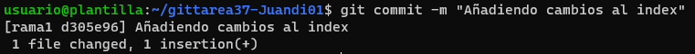
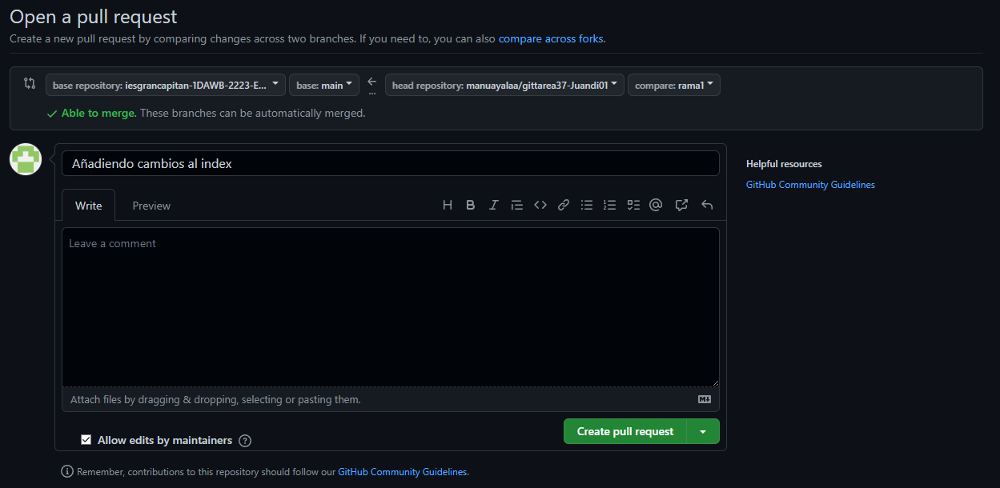

MDAR
#Practica 3.7
###1

En esta primera parte se tiene que hacer un fork a el repositorio del compañero.
###2

En esta segunda se clona el repositorio hecho con el fork.
###3

Aqui en esta parte creo la rama.
##4

En esta parte edito el archivo y hago un commit al index.
##5

En esta parte hago un push de mi repositorio local al remoto.
##6

En esta parte se ve como hago el pull request y una captura desde el github de mi compañero como se ve la pull request.
